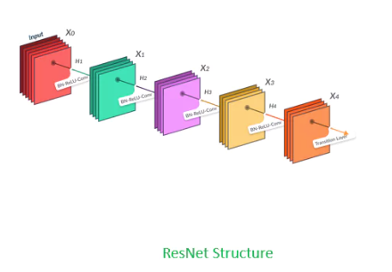
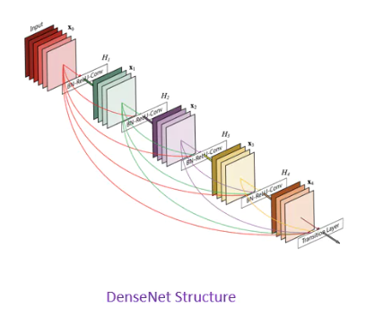
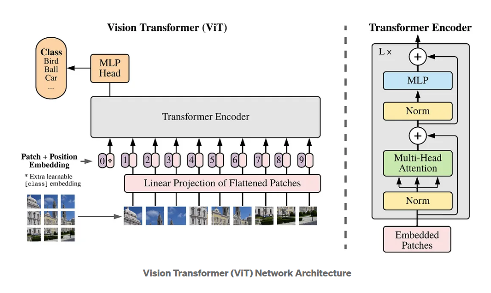
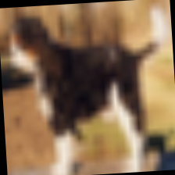
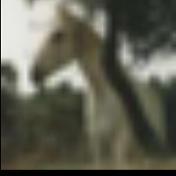
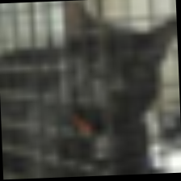

# CIFAR-10 Classification Project

**Name:** Brian Isaac Kam
**Email:** isaacbikjk@gmail.com

---

## Project Overview

This project implements fine-tuning of image classification models (**ResNet**, **DenseNet**, **Vision Transformer**) on the **CIFAR-10 dataset** using PyTorch, Albumentations, and Hydra for modular configuration management, with MLflow integration for experiment tracking.

### Folder Structure
```bash
A5P6_Hands-on-Project-Repository/
├── conf/                  # Hydra configuration files
├── data/                  # CIFAR-10 dataset
├── logs/                  # Training and evaluation logs
├── models/                # Saved model checkpoints
├── src/
│   ├── train.py           # Main training pipeline
│   ├── utils.py           # DataLoader, Trainer, Classifier classes
│   ├── preprocess.py      # Preprocess images for 224x224
│   └── general_utils.py   # Logging and MLflow utilities
├── eda.ipynb              # EDA on CIFAR10 dataset
├── requirements.txt       # Python dependencies
└── run.sh                 # Shell script to execute training
```
---

## Setup & Execution Instructions

1. Install dependencies:
```bash
pip install -r requirements.txt
```
2. Review configurations:
Configurations are managed in `config.yaml` under the `conf` folder.<br>
Update hyperparameters, data paths, or model settings as needed:
```bash
conf/
├── config.yaml
├── logging.yaml
└── ...
```
3. Run training pipeline:
```bash
bash run.sh
```
---

## Dataset Description

- **Dataset:** CIFAR-10 (downloaded via torchvision)
- **Source:** https://www.cs.toronto.edu/~kriz/cifar.html
- **Format:** 60,000 color images, size 32x32 pixels, 10 classes
- **Statistics:**  
  - Training samples: 50,000  
  - Test samples: 10,000  
  - Classes: airplane, automobile, bird, cat, deer, dog, frog, horse, ship, truck

### Potential Challenges

- **Class imbalance:** CIFAR-10 classes are perfectly balanced, but minor variations exist that could affect model calibration.
- **Low resolution:** 32x32 images limit fine-grained feature extraction, posing challenges for complex object recognition tasks.
- **Intra-class variation:** Significant differences in pose, lighting, and background within each class increase model generalisation demands.
- **Inter-class similarity:** Some classes (e.g. cat vs dog) share visual features, increasing the risk of misclassification.

### EDA Findings and Implications

- **Balanced dataset:** Minimal need for class re-sampling strategies.
- **Consistent dimensions and channels:** All images are RGB with 32x32 size, simplifying preprocessing pipelines.
- **Data augmentation opportunities:** Techniques like flipping, cropping, and colour jittering can enhance model robustness to intra-class variation.
- **Model selection considerations:** Pre-trained or deeper architectures may be required to distinguish classes with subtle inter-class differences effectively.

---

## Preprocessing Steps

1. **Dataset Loading**
   - The `ImageLoader` class loads the **CIFAR-10 dataset** using `torchvision.datasets.CIFAR10`.
   - Images are loaded in their original **32x32 RGB format** without applying `ToTensor()` at dataset loading, as Albumentations handles transformations.

2. **Stratified Train-Validation Split**
   - A **StratifiedShuffleSplit** is performed to divide the dataset into training and validation sets while preserving class distributions, ensuring balanced representation of classes in both splits.

3. **Albumentations Transform Pipeline**
   - The transformation pipeline is specified in `config.yaml` and instantiated via Hydra using `instantiate(t) for t in args.transforms.train`.
   - The **transformations include**:
     - `PadIfNeeded`: Pads the image to **at least 110% of the target image size** (e.g. padding from 224 to ~246) to allow for effective random cropping.
     - `RandomCrop`: Randomly crops images to the specified target size (e.g. **224x224**).
     - `HorizontalFlip`: Randomly flips images horizontally with a probability of **0.5**.
     - `Rotate`: Randomly rotates images within a limit of **±15 degrees** with a probability of **0.5**.
     - `CoarseDropout`: Applies dropout to random rectangular regions of the image to simulate occlusion and improve robustness. Configured with:
       - **num_holes_range:** (1, 5)
       - **hole_height_range and hole_width_range:** (10%, 25% of image dimensions)
       - **fill value:** 0 (black holes)
     - `Normalize`: Standardises pixel values to ImageNet means **[0.485, 0.456, 0.406]** and standard deviations **[0.229, 0.224, 0.225]**, aligning with pre-trained model expectations.
     - `ToTensorV2`: Converts the image to a PyTorch tensor in channel-first format (C, H, W).

4. **Image Resizing**
   - The `ImageLoader` class prepends a `Resize` transformation to ensure images are resized to the **target image size (e.g. 224x224)** expected by the models before applying the augmentation pipeline.

5. **DataLoader Wrapping**
   - The processed datasets are wrapped with `AlbumentationsDataset`, which applies these transformations on-the-fly during data loading via PyTorch `DataLoader` for both training and validation batches.


---
## Pipeline Logic & Flow
```bash
+--------------------+
|   Start Pipeline   |
+----------+---------+
           |
           v
+----------------------------------+
|  Load CIFAR-10 Dataset           |
|  (torchvision.datasets.CIFAR10)  |
+----------------------------------+
           |
           v
+--------------------------------------+
|  Stratified Train-Validation Split   |
|  (StratifiedShuffleSplit)            |
+--------------------------------------+
           |
           v
+--------------------------------------+
|  Albumentations Transform Pipeline   |
|  - PadIfNeeded                       |
|  - RandomCrop                        |
|  - HorizontalFlip                    |
|  - Rotate                            |
|  - CoarseDropout                     |
|  - Normalize                         |
|  - ToTensorV2                        |
+--------------------------------------+
           |
           v
+-------------------------------+
|  Resize to Target Image Size  |
|  (e.g. 224x224)               |
+-------------------------------+
           |
           v
+-----------------------------------+
|  Wrap with AlbumentationsDataset  |
+-----------------------------------+
           |
           v
+------------------------+
|  PyTorch DataLoader    |
|  (Train & Validation)  |
+------------------------+
           |
           v
+--------------------------------+
|  CIFARClassifier Model Setup   |
|  (ResNet18, DenseNet121, ViT)  |
+--------------------------------+
           |
           v
+-----------------------------+
|  Trainer Loop               |
|  - Train Epochs             |
|  - Evaluate                 |
|  - Save Checkpoints         |
|  - Log to MLflow            |
+-----------------------------+
           |
           v
+------------------+
|   End Pipeline   |
+------------------+

```
---

## Model Variant Used & Fine-tuning Strategy

#### ResNet18


- A lightweight convolutional neural network with residual connections to prevent vanishing gradients.
- Serves as a "baseline model" with fast training speed and good generalisation on CIFAR-10 due to its simplicity.

#### DenseNet121


- Utilises dense connections, enabling **feature reuse and efficient gradient flow** across layers.
- Suitable when enhanced feature extraction is needed to distinguish between classes with subtle differences.

#### ViT (Vision Transformer)


- Applies transformer attention mechanisms directly to image patches, capturing **global context effectively**.
- Useful for exploring **state-of-the-art transformer-based architectures**, though it demands larger image inputs and greater computational resources.

**Fine-tuning Strategy:**
- Layers frozen: Option to freeze backbone except final classifier layers.
- Classifier head: Replaced with deeper fully connected layers (1024 → 512 → 256 → num_classes) with batch normalisation and dropout.
- **Hyperparameters:**  
    - Learning Rate: 1e-4  
    - Epochs: 5
    - Batch Size: 64  
    - Optimiser: Adam

---

## Evaluation Methodology & Results

- **Metrics:** Accuracy, Precision, Recall, F1-score (macro-averaged)
- **Baseline:** Pre-trained models (ImageNet weights) without fine-tuning (with backbone model weights frozen) for 5 epochs
- **Fine-tuned Performance:** 

| Model        | Baseline Accuracy | Unfrozen Accuracy | w/o Course Dropout |
|--------------|-------------------|-------------------|--------------------|
| ResNet-18    | 51.42%            | 82.01%            | --%                |
| DenseNet-121 | 74.82%            | 94.90%            | 96.44%             |
| ViT-B-16     | 93.72%            | 93.69%            | --%                |

---

## Misclassification Showcase

Below are sample misclassified images from the **DenseNet champion model**, illustrating both typical and extreme errors:

| True Label | Predicted | Image | Notes |
|------------|-----------|-------|-------|
| **Dog** | Cat |  | Common confusion between similar pet classes. |
| **Horse** | Deer |  | Difficulty distinguishing visually similar animals. |
| **Cat** | Truck |  | Rare but severe misclassification, indicating robustness limitations under certain conditions. |

> **Evaluation Summary:**  
> The model performs reliably on distinct classes but struggles with **fine-grained differences** (e.g. dog vs. cat) and exhibits occasional severe misclassifications. Future improvements could include **class-specific augmentations, robustness training, and higher resolution inputs**.

---

## Conclusion & Discussion

This project demonstrates the **power of transfer learning and fine-tuning** for small-scale image classification tasks such as CIFAR-10. By integrating **pre-trained architectures (ResNet, DenseNet, ViT)** with effective data augmentation and modular pipeline design, we achieve significant performance improvements over baseline models.

### Key Takeaways

- **Transfer learning is highly effective** even for low-resolution datasets, enabling rapid convergence and robust feature extraction.
- **Model selection matters:** DenseNet excelled at distinguishing subtle inter-class variations due to its dense connectivity, while ResNet offered faster training with decent accuracy. ViT showed promising results but requires higher input resolutions to fully leverage its attention mechanisms.
- **Data augmentation remains critical**, especially for generalisation in small datasets with intra-class variation and visually similar classes.
- **Modular and reproducible pipelines** using Hydra and MLflow facilitate experimentation, hyperparameter tuning, and deployment readiness in real-world projects.

These findings are broadly applicable to other computer vision tasks, particularly those involving **limited labelled data, class similarity challenges, and the need for efficient deployment pipelines**.


---
